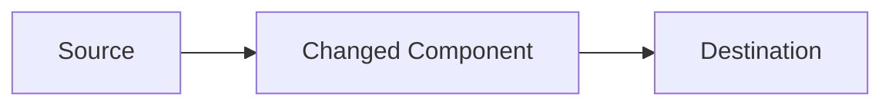

# Session Devlog Skill

## Purpose

Produce a thorough, human-readable Markdown devlog of work done — either from
a live agent session or from git history — and persist it to
`~/.devlogs/<YYYY-MM-DD>/<slug>.md` for future reference.

---

## Mode Detection

Before doing anything else, determine which mode to use:

1. **Mode A (Session)** — There is a meaningful conversation history in the
   current context (the user has been pair-coding with the agent).
2. **Mode B (Git)** — The user invoked the skill with no session context, or
   explicitly mentioned commits / branch / git.

When ambiguous, **ask the user**:

> "Should I summarise our conversation, or read your git commits ahead of
> master to build the devlog?"

---

## MODE A — Agent Session

### A1. Reconstruct session context

Review the full conversation and extract:

- **Goal / requirements** — What was the user trying to achieve? Was there a
  JIRA ticket or GitHub issue? Quote it if available.
- **Files changed** — Every file that was created, modified, or deleted.
- **Nature of each change** — Why it was changed and what the actual
  logic/behaviour delta is (not just "updated X").
- **Decisions made** — Architectural, design, or implementation choices and
  the rationale.
- **Data / code flow changes** — If flows or module dependencies changed,
  plan a Mermaid diagram.
- **User questions & concerns** — Anything the user asked, worried about, or
  flagged that is worth remembering later.
- **Unresolved items** — TODOs, follow-ups, known limitations.

### A2. Choose slug and output path

Pick a lowercase kebab-case slug from the session topic, e.g.
`add-stripe-webhook-handler`, `refactor-auth-flow`.

Run:
```bash
bash scripts/prepare-devlog-dir.sh
```
to create `~/.devlogs/<YYYY-MM-DD>/` and get the date string.

Output path: `~/.devlogs/<YYYY-MM-DD>/<slug>.md`

### A3. Write and save the devlog

Use the **Devlog Template** (see end of this file). Skip sections with no
content; add extra sections when useful. Then save the file and confirm:

```
Devlog saved → ~/.devlogs/<YYYY-MM-DD>/<slug>.md
```

---

## MODE B — Git Commits

### B1. Collect git data

Run the helper script from the workspace root:

```bash
bash ~/.cursor/skills/session-devlog/scripts/get-git-changes.sh [base-branch]
```

`base-branch` is optional; the script auto-detects `master` / `main` and
prefers the most up-to-date remote ref.

The script emits:
- **REPO INFO** — root, current branch, base, merge-base SHA
- **COMMITS** — full log with subject + body
- **CHANGED FILES** — diffstat summary
- **FULL DIFF** — unified diff (lock files and build artefacts excluded)

### B2. Group changes into contexts

Analyse the output and group changes into **thematic contexts** — a context is
a coherent unit of work (e.g. "authentication refactor", "database migration",
"UI layout fixes"). Use these signals:

- Commit message subjects and bodies
- Directory / module structure of changed files
- Semantic relationship between the changes

### B3. Confirm with the user — ALWAYS do this before writing

**If all changes belong to ONE context**, present a concise summary and ask:

> "Here's what I picked up from your commits:
>
> **Context:** \<one-line description\>
> **Commits:** \<N\>
> **Files changed:** \<list\>
> **Summary:** \<2–4 sentence description of the changes\>
>
> Does this look right? Should I go ahead and write the devlog?"

Wait for confirmation before proceeding.

**If changes span MULTIPLE distinct contexts**, ask about **each context
separately**, one at a time:

> "I found changes that seem to cover different areas. Let me check each one:
>
> **Context 1 of N — \<short label\>**
> Files: \<list\>
> What I understand: \<2–3 sentences\>
>
> Is this accurate? Anything to add or correct?"

After the user responds, move to the next context. Once all contexts are
confirmed, ask if they should all go into one devlog file or separate files:

> "These \<N\> contexts are quite different. Should I write one devlog covering
> all of them, or a separate file per context?"

### B4. Incorporate user corrections

If the user corrects any interpretation, update your understanding before
writing. Do not argue — accept the correction and reflect it in the devlog.

### B5. Choose slug(s) and output path(s)

- **Single file:** slug should reflect the overall theme.
- **Multiple files:** one slug per confirmed context.

Run:
```bash
bash scripts/prepare-devlog-dir.sh
```

### B6. Write and save the devlog(s)

Use the **Devlog Template** below. For git-sourced devlogs:
- Populate **Requirements** from commit messages and any ticket refs found
  (e.g. `JIRA-123`, `#42` patterns in commit bodies).
- Populate **Commits** section with the list of SHA + subject lines.
- Populate **Changes Made** from the diff analysis.
- Add Mermaid diagrams if dependency/data flows changed.

Save and confirm:

```
Devlog saved → ~/.devlogs/<YYYY-MM-DD>/<slug>.md
```

---

## Devlog Template

````markdown
# <Title: human-readable version of the slug>

**Date:** YYYY-MM-DD
**Mode:** <Agent Session | Git Commits>
**Branch:** <branch name, if git mode>
**Status:** <In Progress | Completed | Blocked>

---

## Requirements

<!-- JIRA/GitHub ticket URL or key, or a plain description of the goal.
     For git mode: extract from commit messages, PR descriptions, or ticket IDs. -->

## Context & Background

<!-- Why this work was needed; relevant prior state or constraints. -->

## Commits

<!-- Git mode only. List commits included in this devlog. -->

| SHA | Message |
|-----|---------|
| `abc1234` | feat: add webhook signature validation |

## Changes Made

### `path/to/file.ext`

- **What:** <what changed in plain terms>
- **Why:** <requirement or reason>
- **Details:** <non-obvious logic, edge cases, caveats>

<!-- Repeat for every changed file or logical group of files.
     If multiple files share the same change and the same rationale (e.g. several
     locale files all reverted for the same PR reason), collapse them into a single
     entry with a grouped heading like `client/translations/onboarding/*.json
     (non-English)` rather than listing each one individually. -->

## Data / Code Flow

<!-- Include ONLY if flows or module dependencies changed. Use Mermaid. -->



## Decisions & Rationale

| Decision | Alternatives Considered | Reason Chosen |
|----------|------------------------|---------------|
| ...      | ...                    | ...           |

## Questions & Concerns Raised

<!-- Verbatim or paraphrased questions/worries from the session or commit
     messages worth preserving. -->

- ...

## Notes

<!-- Gotchas, useful commands, links, environment quirks, anything else. -->
````
